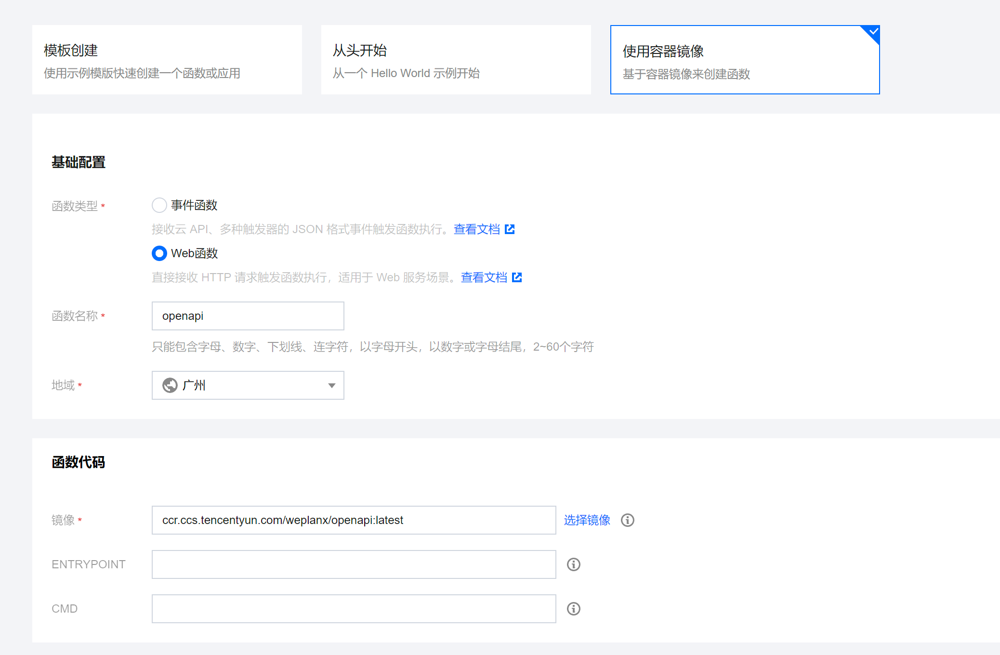

# Weplanx Openapi

Serverless 开放服务主要负责通用信息查询、数据加工、文件处理、工作流等

## 快速部署

镜像源包括：

- ghcr.io/weplanx/openapi:latest
- ccr.ccs.tencentyun.com/weplanx/openapi:latest（国内）

部署在腾讯云，创建云函数并选择“使用容器镜像”，函数类型选择“Web函数”，镜像需要是腾讯云镜像仓库地址（即`ccr.ccs.tencentyun.com/weplanx/openapi`）,最后点击完成

